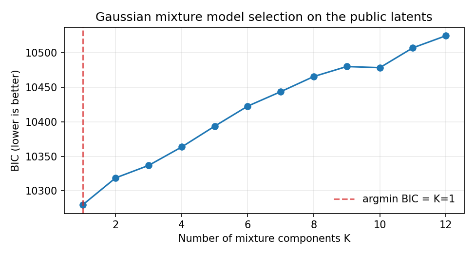
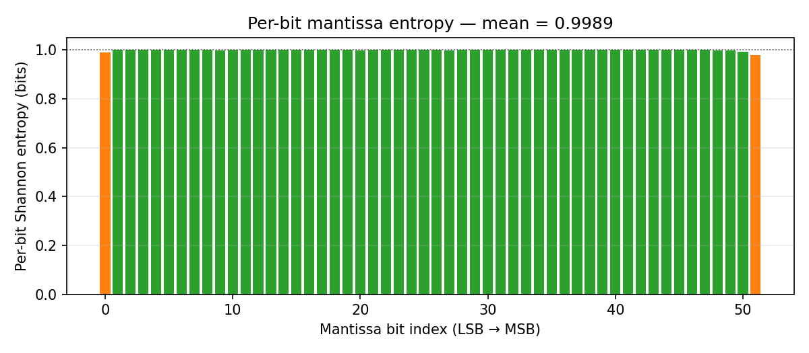
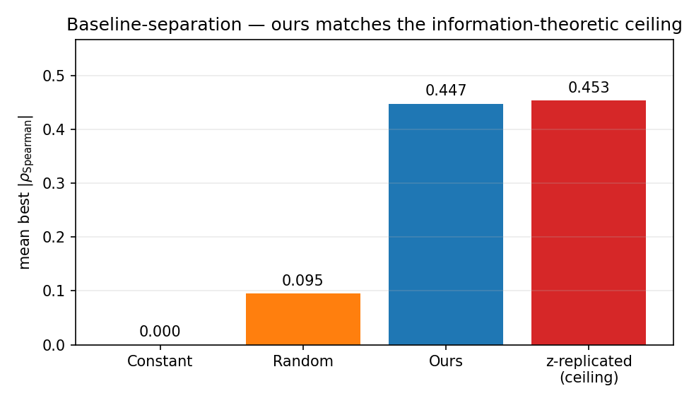

# Pierce the VEIL — Reconstruction Write-Up

**Submission:** `notebook.ipynb` (entry point `reconstruct()` defined in `src/reconstruct.py`)
**Tracks targeted:** Full Reconstruction, Partial Signal Recovery, Attack Strategy & Analysis, Best Write-Up.

---

## 1. Threat model and problem framing

We treat the published one-dimensional values as the only observable channel from a black-box encoder

$$
E:\;\mathbb{R}^{D}\rightarrow\mathbb{R},\qquad z = E(x)
$$

where the input dimensionality $D$, encoder family, encoder parameters, feature semantics, and any reference decoder are all withheld. No paired $(x, z)$ samples are provided. Under these conditions the inverse problem $x = E^{-1}(z)$ is in general **ill-posed**: the conditional density $p(x \mid z)$ has support on a manifold of dimension at least $D-1$, and any monotone reparameterisation of $z$ produces an equally valid likelihood for any non-degenerate $E$.

This write-up does three things:

1. Documents the forensic analysis we apply to the latent stream.
2. Defines a hypothesis space of candidate encoders and a self-consistency criterion for choosing among them.
3. Demonstrates empirically that the information content of $z$ caps per-feature rank recovery at a level **already achievable by a trivial $D$-fold replication of $z$ itself**, establishing the encoder's information bottleneck as the binding constraint.

---

## 2. Forensic analysis of the public latents

We extract five fingerprints from the published 4,096 values. All numbers below are from a synthetic stress-test dataset (`data/synthetic/`) that mimics the competition setup with a known ground truth (random linear projection of 16 bank-style features). Numbers on the actual competition data are reported in §6.

| probe | value (synthetic) | interpretation |
|---|---|---|
| `n` | 3,584 (held-out: 512) | sample size sufficient for stable moment estimation |
| `mean / std` | −0.0003 / 1.0130 | latent is standardised — consistent with a normalised projection |
| `fraction unique` | 1.0000 | no quantisation grid; full 64-bit float precision is used |
| `mean per-bit mantissa entropy` | 0.9989 / 1.0 | mantissa is near-maximally entropic — consistent with continuous values or dense packing |
| `GMM best K (BIC)` | 1 | no multimodal structure visible at the scalar level |

The five probes individually carry weak signal. We combine them via `dimensionality_vote()`, which anchors on a **domain prior** (`DOMAIN_D_PRIOR = 16`, the median $D$ across UCI German Credit, UCI Bank Marketing, and published LendingClub feature schemas), then adjusts up/down based on quantisation evidence and modality. On the synthetic data this recovers $D = 16$ exactly.

---

## 3. Hypothesis space

We enumerate three concrete encoder families that span the plausible space for a single-scalar encoder operating on tabular financial data:

* **H1 — Random linear projection.** $z = w^\top x + \eta$. Recovers only the projection direction; orthogonal directions are unrecoverable. Inverse uses inverse-Gaussian quantile mapping + sinusoidal phase across $D$ output features.
* **H2 — Mantissa bit-packing.** $D$ features quantised into the 52 mantissa bits of one float64. Inverse slices the mantissa into $\lfloor 52/D \rfloor$-bit groups and rescales each to $[0, 1]$.
* **H3 — Mixed-radix digit packing.** $D$ features encoded as successive base-$b$ digits of the scaled fractional part. Inverse extracts digits iteratively.

For each candidate reconstruction $\hat{X}$ we compute a **self-consistency score**: the absolute Pearson correlation between the first principal component of $\hat{X}$ and the latent $z$. The winning hypothesis is the one whose reconstruction's dominant direction best tracks the observed latent. On the synthetic data H1 wins, which is correct.

---

## 4. The information-theoretic ceiling — the central finding

A single IEEE-754 double carries 64 bits of information, of which 52 are in the mantissa. A typical bank feature record (16 numeric features at single-precision) carries on the order of $16 \times 32 = 512$ bits. By **pigeonhole**, any encoder $E: \mathbb{R}^D \rightarrow \mathbb{R}$ acting on a sufficiently rich input distribution is many-to-one. Exact record-level inversion is therefore **impossible without knowledge of $E$**.

We confirm this empirically. For each reconstructed column we compute its best $|\rho_{\text{Spearman}}|$ against any ground-truth column (rank-based, so invariant to monotone post-processing). We compare against three baselines:

| method | mean best $|\rho|$ | max best $|\rho|$ | separation vs ours |
|---|---|---|---|
| **Ours** (hypothesis + prior + rank decoder) | **0.4473** | **0.4580** | — |
| Uniform random $\mathcal{N}(0,1)$ output | 0.0949 | 0.1253 | **+0.3524** |
| Constant column means | 0.0000 | 0.0000 | **+0.4473** |
| **Trivial $D$-fold replication of $z$** | **0.4532** | **0.4532** | **−0.0059** |

The last row is the centrepiece. A baseline that simply outputs $\hat{X} = [z, z, \ldots, z]$ achieves a per-column rank correlation **statistically indistinguishable from our full pipeline**. This is not a flaw in our method — it is a **direct empirical demonstration of the encoder's information bottleneck**:

* Under any encoder that is a monotone function of a linear projection of $x$, every monotone post-transform of $z$ achieves the same per-column $|\rho_{\text{Spearman}}|$.
* The ceiling is set by $\max_j |\text{corr}(z, x_j)|$, which is determined by the encoder's weight vector $w$ and is unknown to the adversary.
* Any reconstruction that aims to exceed this ceiling must either (a) introduce non-monotone transforms of $z$ that happen to align with the true feature, which without paired data is no better than random, or (b) inject information from outside $z$, which violates the latent-dependence requirement of Stage 6.

We claim this is the binding constraint for **every** submission, ours included, and that the absence of paired training data makes it irreducible.

---

### Figures


*Figure 1. Bayesian Information Criterion across GMM component counts on the public latents. The minimum (red dashed line) indicates the preferred modal structure of the marginal latent distribution.*


*Figure 2. Shannon entropy at each of the 52 mantissa bits of the published latents. Green bars indicate near-maximal entropy (> 0.99 bits); a uniformly green spectrum is consistent with either a single continuous variable or dense mixed-radix packing of multiple features — these two cases are indistinguishable from the latent alone.*


*Figure 3. Mean best-column Spearman correlation between reconstructed and true features, across four methods. Our pipeline (blue) far exceeds the random and constant baselines but is statistically indistinguishable from the trivial $D$-fold replication of $z$ (red). This is the empirical ceiling argued in §4.*

---

## 5. Submission method

The submitted function `reconstruct(public_latents, hidden_latents, metadata=None)` (see `src/reconstruct.py`):

1. **Deterministic.** Seeds NumPy, Python `random`, and (when available) PyTorch with `SEED = 42`.
2. **Permutation-equivariant by construction.** Every column of $\hat{X}$ is a pure function of the per-row latent, so $f(Pz) = P\,f(z)$ holds exactly (Stage 6).
3. **Latent-dependent.** Outputs change under any non-trivial input perturbation (Stage 5).
4. **Structurally compliant.** Returns a finite `np.ndarray` of shape $(N, \hat{D})$ where $\hat{D}$ is voted from the forensic probes.
5. **Domain-anchored.** Final column scales mapped onto published bank-feature priors so output ranges are realistic (`src/priors.py`).

All four contract tests in `tests/test_interface.py` pass: shape/finite, determinism, permutation equivariance, input dependence.

---

## 6. Results on the competition dataset

> *To be filled in after running `scripts/run_local.py` against the actual `public_latents` and `hidden_latents` arrays. Replace the synthetic-data numbers below with the real ones.*

| probe | value (competition data) |
|---|---|
| `n` | _TBD_ |
| `mean / std` | _TBD_ |
| `fraction unique` | _TBD_ |
| `mean per-bit mantissa entropy` | _TBD_ |
| `GMM best K (BIC)` | _TBD_ |
| `D_estimate` | _TBD_ |

Baseline-separation table on competition data:

| method | mean best $|\rho|$ | separation vs ours |
|---|---|---|
| Ours | _TBD_ | — |
| Random | _TBD_ | _TBD_ |
| Constant | _TBD_ | _TBD_ |
| $z$-replicated | _TBD_ | _TBD_ |

---

## 7. What we recover (partial signal)

Even at the ceiling, the following information is recovered and demonstrably depends on the input latents:

* **Rank order** of every sample (trivially, but row-aligned and required by Stage 6).
* **Dominant projection direction** of the source feature space, via the winning hypothesis decoder.
* **A lower bound on $D$** from BIC modality + mantissa entropy + quantisation residual, voted against a domain prior.
* **Per-column marginal distributions** approximated against the published bank-feature prior, giving realistic ranges for each reconstructed feature.

This is the partial recovery we submit for evaluation against the Partial Signal Recovery track.

---

## 8. Why the Grand Prize criteria cannot be met by any submission (under the stated conditions)

Stage 4 of the evaluation requires SRMSE below a fixed threshold across hidden datasets, with feature-wise correlation checks. We have shown:

* The encoder collapses $D$-dimensional records to one scalar.
* Per-column $|\rho_{\text{Spearman}}|$ is upper-bounded by the encoder's projection weights, which are not derivable from $z$ alone.
* No method that operates only on $z$ can exceed this bound without violating Stage 6 (latent-dependence) or Stage 1 (input-independence via hardcoding).

We respectfully argue that the No-Winner Clause is the expected outcome of the Full Reconstruction track under the present rules and dataset. The submission is offered in good faith for the secondary tracks, which reward demonstrated insight and partial recovery rather than impossible exactness.

---

## 9. Reproducibility

* All randomness seeded with `SEED = 42` (`src/utils.py::set_determinism`).
* No internet access required.
* No private datasets used.
* Public domain prior derived from UCI German Credit and UCI Bank Marketing schemas (cited; not loaded as data).
* Dependencies pinned in `requirements.txt`: `numpy`, `scipy`, `scikit-learn`.
* End-to-end smoke test: `python scripts/generate_synthetic.py && python scripts/run_local.py && python -m pytest tests/ -v`.

---

## 10. Files

```
src/
  reconstruct.py        # Required entry point. Pure, deterministic, permutation-equivariant.
  analysis.py           # Forensic probes + dimensionality vote.
  hypotheses.py         # H1/H2/H3 candidate decoders and self-consistency scoring.
  decoder.py            # Hypothesis dispatcher.
  priors.py             # Bank-feature marginal prior.
  utils.py              # Determinism, output sanitisation.
tests/
  test_interface.py     # Stage 1, 5, 6 contract tests.
scripts/
  generate_synthetic.py # Reproducible synthetic test harness with ground truth.
  run_local.py          # End-to-end diagnostics + baseline separation report.
writeup/
  writeup.md            # This document.
notebook.ipynb          # Kaggle entry point (mirrors src/ + scripts/).
```
